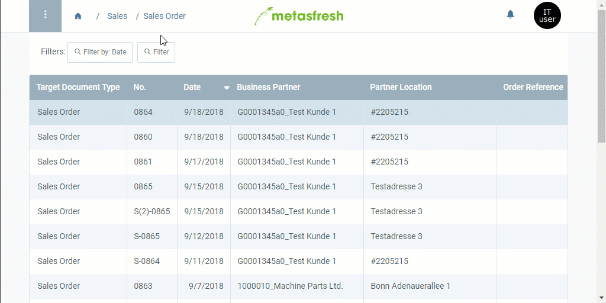

## Overview
In metasfresh, you can quickly and easily void a [sales order](SalesOrder_recording) along with all related documents, such as [delivery notes](Ship_SalesOrder), [invoices](Invoice_SalesOrder), [contracts](Create_subscription_contract), [contract extensions](Extend_contract), etc.

For example, if mistakes were carried over from a sales order into the subsequent documents, you can use this action to revert these mistakes and render them ineffective altogether. A draft of the original sales order will automatically be created for you to review, edit and complete again.

## Steps
1. Open "Sales Order" from the [menu](Menu).
1. From the [list view](ViewModes#list-view), [select](RecordSelection) the [completed sales order](SalesOrder_recording) you want to void along with all related documents.
1. [Start the action](StartAction#actions-menu) "Void selected order with related documents". An overlay window opens up.
 >**Note:** You can also start this action directly from the respective sales order's entry.

1. Click "Start" to void all documents and close the overlay window.
1. Press `Ctrl`/`⌘ cmd` + `⇧ Shift` + `R` to refresh the sales order window. The voided order now appears in the [list view](ViewModes#list-view).
1. [Use the filter](Filtering_function) to find the voided sales order and its newly created draft using the original sales order number.

## Next Steps
- Revise the newly created sales order draft and [complete it](DocumentProcessingComplete).

| **Note:** |
| :--- |
| The number of the voided sales order is now preceded by an "S-" (e.g., "S-0864"; S = Reversal, Ger.: _**S**torno_) and the status of the related documents is changed to *reversed*. The newly created draft is given the original sales order number (e.g., "0864") which cross-references the voided order and may be used to look up the drafted order under "[Sales Order](Menu)" in the menu using the [filtering function](Filtering_function). |

## Example
<kbd></kbd>
