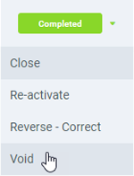
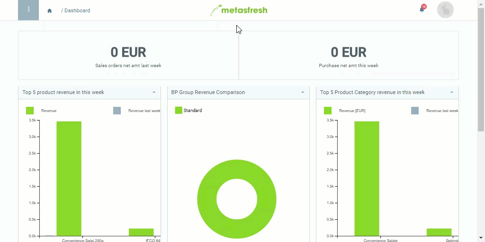

## Overview
In metasfresh, you can quickly cancel incorrectly booked payments and at the same time reverse the *Paid* status of the assigned invoices. To do so, please proceed as follows:

## Steps
1. Open "Payment" from the [menu](Menu).
1. Open the entry of a [posted payment](Single_incoming_payment).
1. Open the [document processing menu](StartAction) (`Alt` + `I` / `⌥ alt` + `I`) and click on *Void*. The payment has now been reversed. 

1. [metasfresh saves the progress automatically](Saveindicator).

## Example

