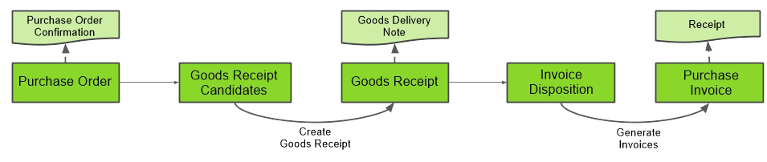

## Steps
1. [Log in to the system](Login).
1. [Record a new purchase order](CreatePurchaseOrder).
1. [Create a goods receipt](CreateGoodsReceipt) for your purchase order.
1. [Create an invoice](CreatePurchaseInvoice) for your purchase order.
