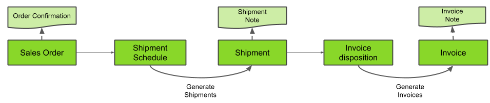

## Steps
1. [Log in](Logon) to the system.
1. [Record a new sales order](SalesOrder_recording).
1. [Create a shipment](Ship_SalesOrder) for your sales order.
1. [Create an invoice](Invoice_SalesOrder) for your sales order.
