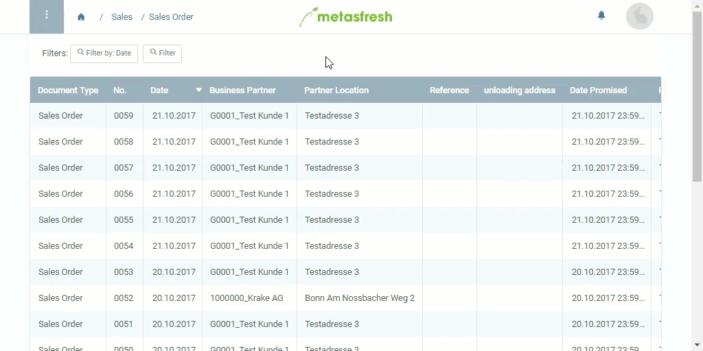

## Overview
In metasfresh you can also use the *zoom feature* to access the content of many table fields. Often this is a good way to bypass the navigation menu and quickly switch between the windows.

## Steps
1. Hover with your mouse cursor over the table field of which you want to review or edit the content, and right-click it to open the context menu.
1. Click on .
1. A new tab window opens up showing you the field's detailed content.

**Important:** You might need to disable your pop-up blocker to make this feature work.

## Example

