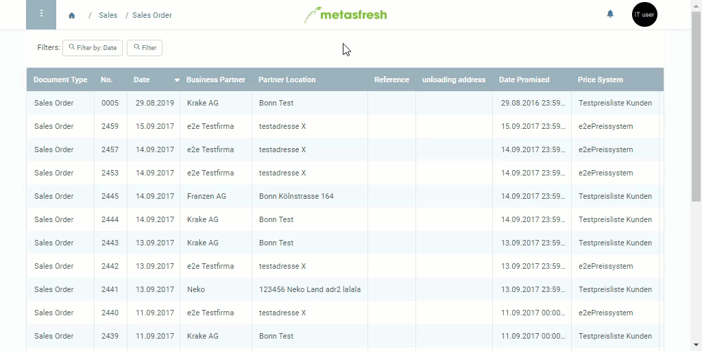

## Overview
When creating a document with similar or identical data as in an existing document, you do not want to lose time by recording it all over again. To make things easier, you can use the *clone feature* to duplicate the entire existing document data of a window with all associated subtabs. 
Cloning works with all master data and documents such as sales order, purchase order, etc.

## Steps
1. Use the [menu](Menu) to navigate to the document you want to clone (e.g., a [sales order](SalesOrder_recording)) and open it.
1. [Start the action](StartAction) "Clone".
1. The entire cloned document will open up in a new tab.
 >**Note 1:** Except for variable data, such as serial numbers or search keys (product numbers, document numbers, etc.), all data are cloned unchanged.  
 >**Note 2:** Completed documents, such as sales orders, are cloned as drafts so they can be modified if necessary, and then have to be [completed manually](DocumentProcessingComplete) again.

## Example
 
