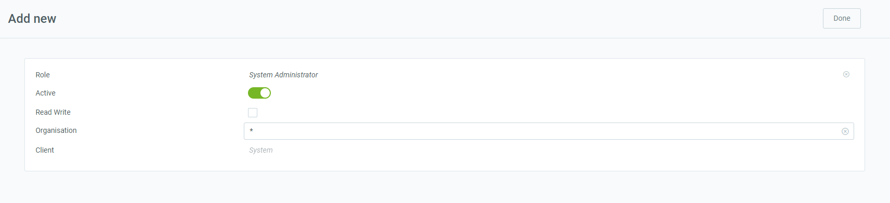

## Overview
Processes can be created in two ways: via the WebUI (see steps below) or [via the Java client](../../appdictionary_collection/EN/how_to_create_processes).

## Setup Steps for WebUI

### Log in and create a new process
1. [Log in to metasfresh](Login) with the [user role](NewUserRole) "System Administrator".
1. Open "Report & Process" from the [menu](Menu).
1. [Create a new entry](New_Record_Window).

### Set up the process
1. **Search Key**: This is the internal search name and ***must be unique***.
1. **Process**: Designation of the process.
1. **Name**: This is the name that will be displayed in the actions menu.
1. **Entity Type**: This is the dictionary entry type determining mapping, ownership and synchronization.
1. **Type**: Defines the validation of the process type.
1. **Active**: Must be enabled for the process to appear in the actions menu.
1. **Data Access Level**: Specifies who has access to this process and who can use it.
  >**Note:** This field is located in the [advanced edit menu](ViewModes#adv-edit) via the [actions menu](StartAction#actions-menu) (shortcut `Alt` + `E` / `⌥ alt` + `E`).

<kbd></kbd>

### Report Access tab
Here you can enter the access rights for the roles. Go to the record tab "Report Access" at the bottom of the page and click . An overlay window opens up.

<kbd></kbd>

### Parameters
Go to the record tab "Report Access" at the bottom of the page and click . An overlay window opens up.

1. **Sequence**: The way all parameters are ordered (usually in steps like 10, 20, 30, etc.)
1. **Name**, **Description**, **Comment/Help**: Contain information and help about the parameter needed to enter. The name and description are visible to the user.
1. **DB Column Name**: Defines how the column is named.
1. **System Element**: The system element can be selected from the already existing system elements and also prefills Name, DB Column Name, Description and Comment.
1. **Reference**, **Reference Key**: Shows the type of parameter and optionally a key if the data is in a table or list.
1. **Mandatory**: If this checkbox is ticked, the user must enter information and cannot leave it blank.
1. **Entity Type**: Shows what Entity Type the parameter is.
1. **Default Logic**: Defines what value should be selected as default. See also: [How to provide the result of an SQL to a user by running a process](../../appdictionary_collection\EN\configure_sql_process).

<kbd></kbd>

### Assigned to tables tab
Go to the record tab "Assigned to tables" at the bottom of the page and click . An overlay window opens up.
1. **Table**: The table to which the process is applied.
1. **Entity Type**: The dictionary entry type. It determines ownership and synchronization.

<kbd></kbd>
