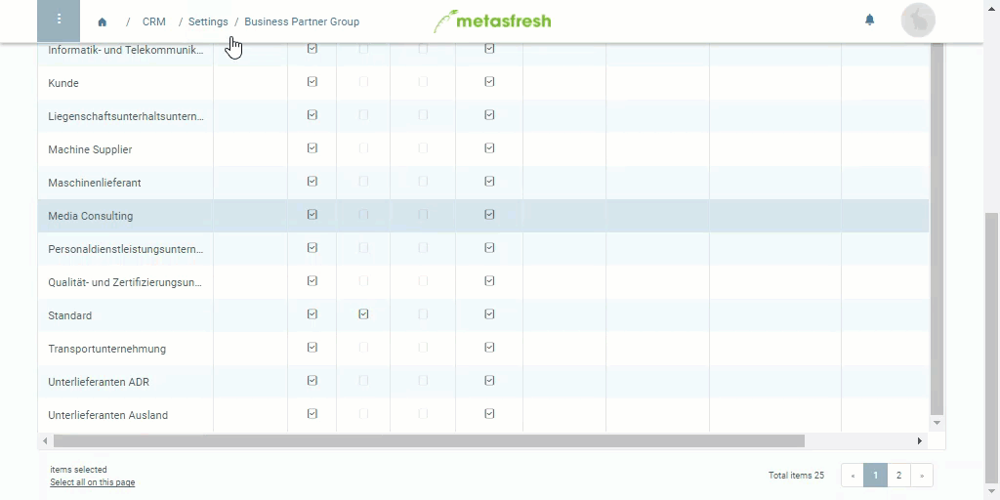

## Overview
For a Dunning Type to be effective in connection with a partner, you first need to link it to the corresponding partner. You can link it to both a single customer and a business partner group.

## Link Dunning Type to a single Customer

### Steps
1. Open an existing customer entry from your [business partners](Menu) or [create a new customer](New_business_partner_customer).
1. Go to the tab "Customer" at the bottom of the page and open the [Advanced Edit Menu](Open_AdvancedEditTab).
 >**Note:** The business partner must be registered as a customer for dunning to be available.

1. In the field **Dunning** select the desired dunning type.
1. Click "Done" to close the window and apply the changes.
 >**Note:** Alternatively you can also double-click the field in the column **Dunning** of the customer line and select a dunning type from the drop-down list.

### Example

---

## Link Dunning Type to a Business Partner Group

### Steps
1. Open an existing [Business Partner Group](Menu) or [create a new one](New_Business_Partner_Group).
1. Open the Advanced Edit Menu from the [Actions Menu](StartAction).
 >**Note:** Use shortcut `Alt + E`

1. Scroll down to the field **Dunning** and select the desired dunning type.
1. Click "Done" to close the window and apply the changes.

### Example

