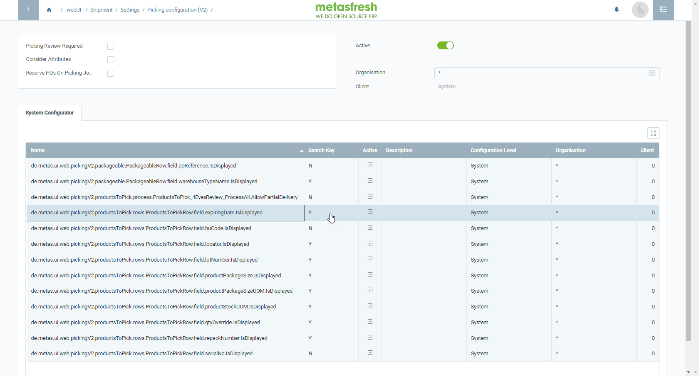

## Steps
1. [Log in to metasfresh](Login) with the [user role](NewUserRole) "System Administrator".
1. Open "Picking Configuration (v2)" from the [menu](Menu).
1. Open the existing (active) configuration entry.
1. Go to the record tab "System Configurator" at the bottom of the page and find the line called: 
`de.metas.ui.web.pickingV2.productsToPick.rows.ProductsToPickRow.field.expiringDate.IsDisplayed`.
1. Double-click the field in the column **Search Key** of the configuration line and enter
    - `Y` to activate display of the field.
    - `N` to hide the field.
1. [metasfresh saves the progress automatically](Saveindicator).

## Example
<kbd></kbd>
