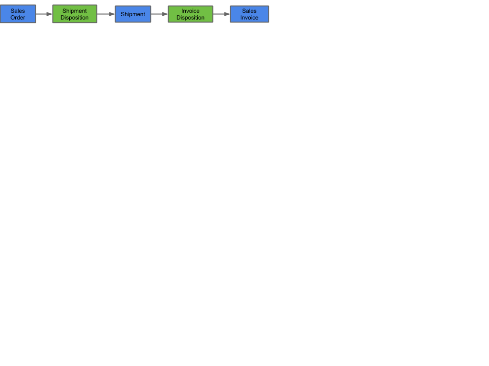

---
---
#Navigating to related data
The following paragraphs describe the different ways to find related data throughout metasfresh.

##Use Relations to browse the workflow

Click on in window e.g. sales order to jump to other data like shipment schedule, invoice schedule, etc. in order to navigate through the workflow.
Example: Clicking on Shipment Disposition from sales order window will open the window “Shipment Disposition” only showing the records that are related to the sales order we started from.
